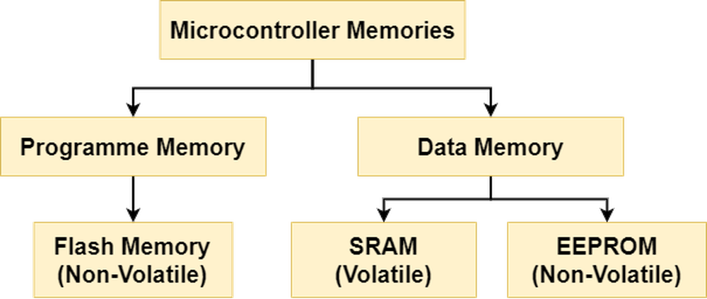
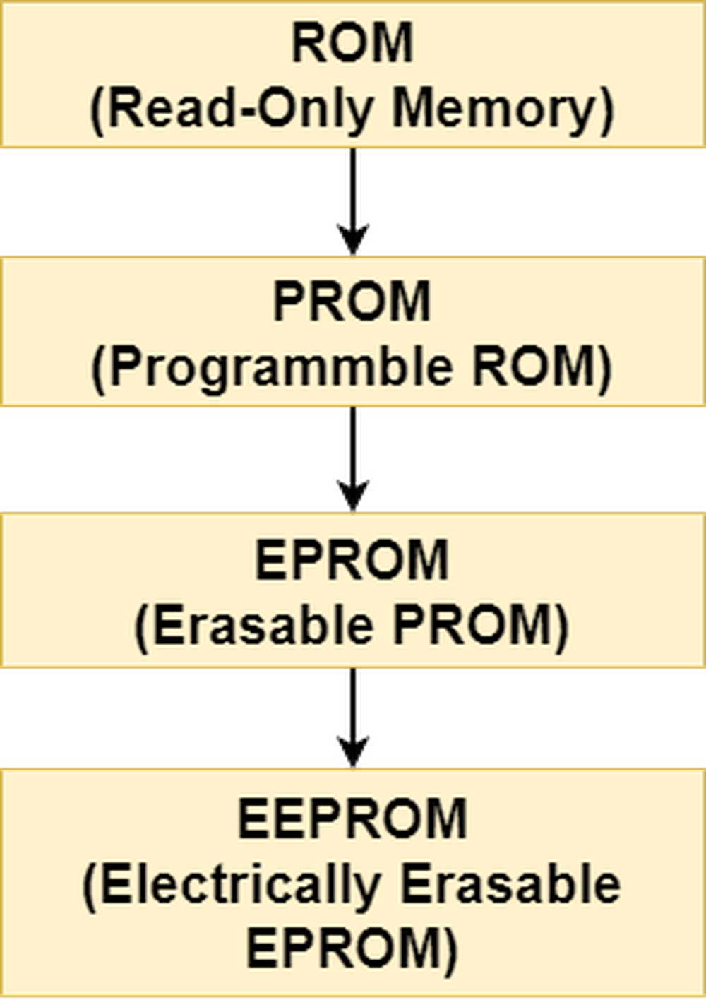

# 第九章——单片机的存储器和EEPROM

## 1. 单片机的存储空间

一般单片机的存储空间可以用下图表示：



单片机中**SRAM(Static Random-Access Memory)**，主要是用于存储程序运行过程中的变量，因为RAM拥有读写速度快的优点，但是RAM的数据在掉电后会丢失。

**EEPROM(Electrically Erasable Programmable Read-Only Memory)**，也称\\(E^2PROM\\)，指的是**电可擦可编程只读存储器**，主要用于存储重要的用户数据，读写速度比较慢。

EEPROM的主要特点如下：

- **擦除区域小，一开始只有一个字节，后来支持多字节页擦除**
- **有限的擦写周期，一般是1000,000次**
- **能够长期存储数据，掉电后数据也不会丢失**

单片机中的EEPROM的由来和发展非常有意思，可以用下面的图表示：



Flash和EEPROM在某些方面比较相似。因为Flash就是由EEPROM发展而来，支持大擦除块，一般是**512字节甚至更高**，EEPROM不仅擦除块小，且每次擦除都需要大概3.3ms左右，因此，Flash更适合用来做为程序储存空间。Flash和EEPROM一样，掉电后数据不会丢失，属于**Non-Volatile Memory**，因此在一些没有EEPROM的单片机上，可以使用Flash代替EEPROM，比如ESP32。但是Flash的擦写周期要比EEPROM短，通常在**10,000**次。

每次我们编译Arduino的代码是，窗口下的终端显示了SRAM和FLASH的使用情况，也就是变量存储空间和程序存储空间。

## 2. Arduino的EEPROM库

Arduino的AVR单片机的ATmega328芯片，拥有**1024字节**的EEPROM，ATmega168和ATmega8拥有**512字节**的EEPROM，而ATmega1280和ATmega2560拥有**4096字节**的EEPROM。

所以我们经常使用的Arduino Uno拥有1KB的EEPROM。

Flash和SRAM大家日常都在使用，下面我们学习如何通过Arduino官方的EEPROM库读写EEPROM：

### 2.1 read()

语法：

```cpp
EEPROM.read(address);
```

该函数用于读取EEPROM中一个字节的数据，未写过的区域读取的值为255。

参数address：EEPROM中的地址，对于Uno，就是0-1023。

### 2.2 write()

语法：

```cpp
EEPROM.write(address, value);
```

该函数用于向EEPROM写入一个字节的数据。

参数address：EEPROM中的地址，对于Uno，就是0-1023。

参数value：需要写入的数据，数据类型为`uint8_t`。

### 2.3 update()

语法：

```cpp
EEPROM.update(address, value);
```

用法类似于`EEPROM.write(address, value)`，也是向EEPROM写入一个字节的数据，只是该函数在写入前会检查写入值和已有值是否相同，不同才会写入。那是因为EEPROM有着有限次数的擦写周期，因此建议使用`update`代替`write`。

参数address：EEPROM中的地址。

参数value：需要写入的数据，数据类型为`uint8_t`。

下面是一个使用了update和read的实例，供大家参考：

```cpp
#include <EEPROM.h>

void setup() {
  uint8_t data = 123;
  int address = 0;

  // Wait open serial monitor
  Serial.begin(115200);
  while (!Serial);

  // Write data to EEPROM
  Serial.print("Write data to EEPROM: ");
  EEPROM.update(data, address);

  // Read data from EEPROM
  Serial.print("\nRead data from EEPROM: ");
  data = EEPROM.read(address);
  Serial.println(data, 3);
}

void loop() {
}
```

### 2.4 put()

语法：

```cpp
EEPROM.put(address, data);
```

作用类似于write函数，也是向EEPROM写入数据，但该函数支持写入原始的数据类型，不局限于一个字节的数据，可以是`float`、`int`、`String`等。

参数address：EEPROM中的地址。

参数data:：需要写入的数据，可以是原始的数据类型。

### 2.5 get()

语法：

```cpp
EEPROM.get(address, data);
```

作用类似于read，用于从EEPROM读取数据，但该函数支持读取原始的数据类型，不局限于一个字节的数据，可以是`float`、`int`、`String`等。

参数address：EEPROM中的地址。

参数data：需要读取的数据类型。

下面是一个使用了put和get的实例，供大家参考：

```cpp
#include <EEPROM.h>

void setup() {
  float data = 123.45;
  int address = 0;

  // Wait open serial monitor
  Serial.begin(115200);
  while (!Serial);

  // Write float to EEPROM
  Serial.print("Write float to EEPROM: ");
  EEPROM.put(data, address);

  // Read float from EEPROM
  Serial.print("\nRead float from EEPROM: ");
  EEPROM.get(address, data);
  Serial.println(data, 3);
}

void loop() {
}
```