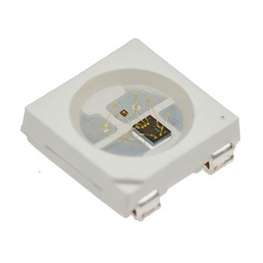

# 第一章——One-Wire通信原理

## 1. 通信机制

不同的设备单总线通信机制大都不同，总的来说，单总线的基本的通信方式就是通过调整高低电平的时长来发送‘0’和‘1’，通过起始位和终止位来开始和结束通信。

因此在这里我们就不做理论上的介绍了，我们后面再具体问题具体分析。

## 2. 适用于哪些设备

常见的使用单总线的设备有以下几个：

|                              DHT11                               |                              WS2812                               |                              IR Receiver                               |
| :--------------------------------------------------------------: | :---------------------------------------------------------------: | :--------------------------------------------------------------------: |
|  |  |  |

后面我们将具体学习DHT11的单总线通信方式，有兴趣的可以自行学习其他种类的元器件。