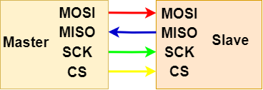
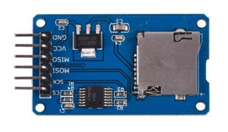
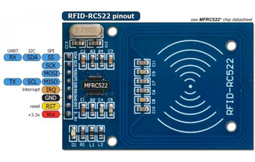
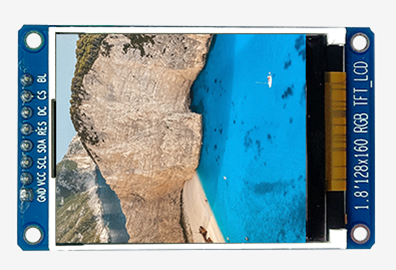

# 第一章——SPI通信原理

## 1. SPI引脚介绍

下面是典型的单主从机模式的SPI示意图：



- **MOSI(Master In Slave Out)**——用于主机向从机发送数据。
- **MISO(Master In Slave Out)**——用于从机向主机发送数据。
- **SCK(Serial Clock)**——用于同步主从机的通信过程。
- **CS(Chip Select)**——也称SS(Slave Select)，用于主机选择需要通信的从机。

## 2. CPOL和CPHA

前面讲到，SPI的通信协议有着灵活的变种，下面讲一讲其中的主要两个不同，一个是**CPOL(Clock Polarity)**，另一个是**CPHA(Clock Phase)**，也就是时钟极性和时钟相位。

CPOL简单来说，时钟在高电平或低电平时是否空闲。如果CPOL＝0，则先出现上升沿，再出现下降沿；反之，先出现下降沿，再出现上升沿。大部分设备CPOL＝0。

CPHA简单来说，这些模式控制数据是否在数据时钟信号的上升沿或下降沿移入和移出。如果CPHA=0，MOSI和MISO在时钟线的的上升沿读取数据，下降沿改变数据；如果CPHA=1，MOSI和MISO在时钟线的下降沿读取数据，上升沿改变数据。大部分设备CPHA＝0。

由于CPOL和CPHA的存在，SPI通信可以分为以下四类：


通常情况下，SPI的通信模式为**模式0**。

## 3. SPI的通信过程

SPI虽然不像UART那样，没有开始位和结束位；但是和I2C相似，有开始信号和结束信号。

开始信号，主机拉低CS，表示通信开始。

结束信号，主机拉高CS，表示通信结束。

一般在通信过程了中，MOSI和MISO可以不间断地传输数据，在这之间没有校验的信息位，通常都是**高位在前，低位在后**。

下面是模式0的SPI通信时域图：


## 4. SPI的优缺点

SPI通信的优点：

- **没有开始位和结束位，可以连续发送数据**
- **没有复杂的设备地址，取而代之的是CS**
- **MOSI和MISO可以让设备同时发送数据**
- **传输速度快，正常都可以达到10MHz甚至更高**

SPI通信的缺点：

- **四根线，有的设备还有D/C线，RST线等等，接线相对复杂**
- **无ACK验证信息是否传输成功**
- **无校验信息**
- **只能有一个主机**

## 5. Arduino的SPI库

Arduino支持的官方SPI库就是`SPI.h`，Arduino Uno同样只有一个SPI接口，即**MOSI—D11，MISO—D12，SCK—D13，CS—D10**，你可以使用引脚作为CS，不一定是D10。

下面我们对SPI库部分重要函数做简单讲解。

### 5.1 begin()

语法：

```cpp
SPI.begin();
```

用于初始化SPI。默认使用SPI模式0，4MHz时钟频率，拉高CS，拉低SCK和MOSI。

### 5.2 beginTransaction()

语法：

```cpp
SPI.beginTransaction(mySettings);
```

可以用来替代`SPI.begin()`，用于配置更加详细的信息，参数为**SPISettings**的对象。

### 5.3 SPISettings

语法：

```cpp
SPISettings mySettting(speedMaximum, dataOrder, dataMode);
```

参数speedMaximum：用于设置SPI时钟频率，默认为4MHz，一般这个参数要小于单片机的时钟频率，Uno板可以达到14MHz。

参数dataOrder：用于设置传输数据时，是低位在前还是高位在前，默认是高位在前。可选值为`MSBFIRST `和`LSBFIRST`。

参数dataMode：用于设置SPI通信的模式，模式为前面介绍的4种模式，默认为模式0。可选值为`SPI_MODE0`，`SPI_MODE1`，`SPI_MODE2`和`SPI_MODE3`。

因此一般设置为：

```cpp
SPI.beginTransaction(SPISettings(14000000, MSBFIRST, SPI_MODE0));
```

### 5.4 transfer(), transfer16()

语法：

```cpp
uint8_t receivedVal = SPI.transfer(val);
uint16_t receivedVal16 = SPI.transfer16(val16);
SPI.transfer(buffer, size);
```

用于发送和接收数据。参数和返回值的数据类型可以是`uint8_t `或者`uint16_t`，也可以发送一个数据类型为`uint8_t `的数组。

下面是一个使用简单传输一个字节的数据的例子，使用了默认的配置，大家可以参考一下：

```cpp
#include <SPI.h>
#define CS 10

void setup() {
  pinMode(CS, OUTPUT);
  SPI.begin();

  // transfer data 128
  digitalWrite(CS, LOW);
  SPI.transfer(128);
  digitalWrite(CS, HIGH);
}

void loop() {
}
```

## 6. 适用于哪些设备

常见的使用SPI的设备有以下几个：

|                          SD Card Module                          |                          RFID Module                          |                       ST7735 TFT Display                        |
| :--------------------------------------------------------------: | :-----------------------------------------------------------: | :-------------------------------------------------------------: |
|  |  |  |

下一个章节我们将详细学习如何通过SPI向SD Card读写数据。