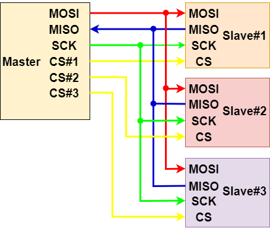

# 介绍

## 1. 什么是SPI通信

SPI(Serial Peripheral Interface)是一种同步串行通信，由**Motorola**公司发明于1980s，同样是单片机通信当中非常常用的通信方式之一。SPI和I2C的最大的不同就在于SPI的**Peripheral**，为什么一个串行通信会有并行这个概念，那是因为SPI在通信过程中，可以主从机同时通信，也就是**Peripheral**的由来。

SPI在通信协议上有着比较灵活的变种，SPI没有字节数的限制，除了8位，还有12位，16位等等；有的SPI设备是**只读**，有的是**只写**，也就是说这些设备只能被写入数据，有的只能被读取数据，这时候就由标准的4-wire变成了3-wire。

## 2. SPI的外设

SPI几乎不需要什么外设，这也降低了SPI通信的功耗，只是SPI的接线要比I2C复杂一些，同时SPI也支持同时连接多个设备通信，只是同时也只能由一个主机，一般是MCU。

下面是标准的SPI通信示意图：

