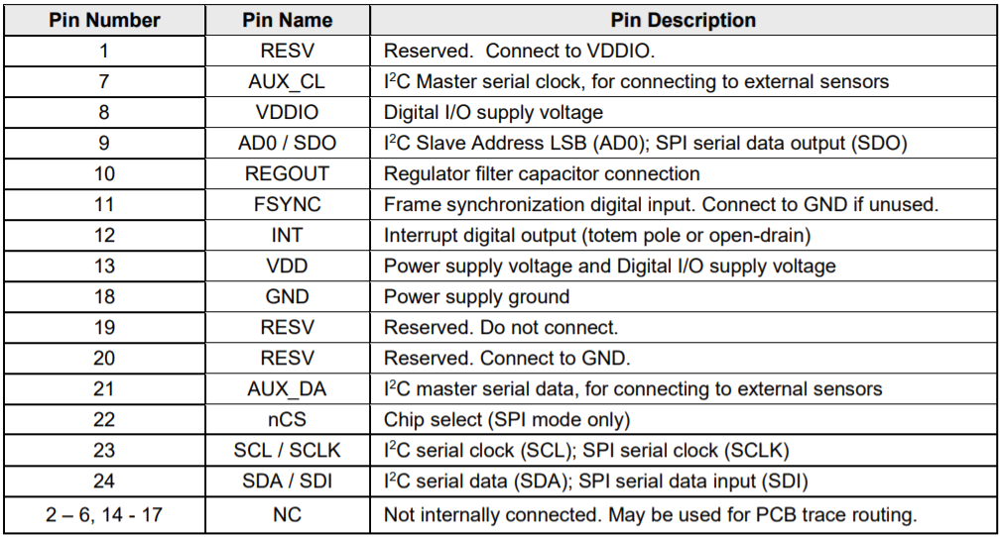
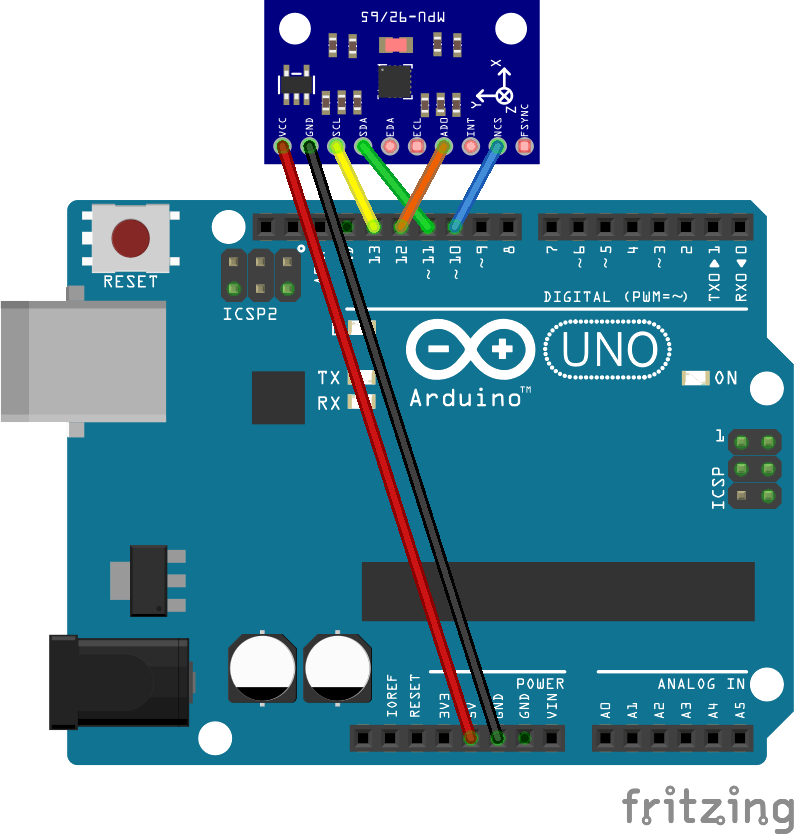
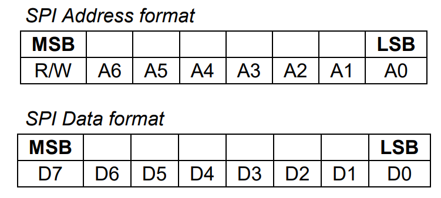

# 第二章——MPU9250数据手册速览

## 1. MPU9250基本参数

|    参数     |                  参数值                   |
| :---------: | :---------------------------------------: |
|  供电电压   |                 2.4V-3.6V                 |
|  通信方式   |                I2C或者SPI                 |
|  通信速度   |      I2C不大于400KHz，SPI不大于1MHz       |
|  9轴传感器  |     3轴陀螺仪，3轴加速度计，3轴磁力计     |
| 温度传感器  |              -40°C 到 +125°C              |
|    FIFO     |               512字节的FIFO               |
|    中断     |             支持多种模式中断              |
| 外部震荡源  |               支持外部晶振                |
| I2C主机模式 | MPU9250支持作为I2C主机，可同时连接4台设备 |

## 2. MPU9250引脚分布

|     引脚      |                         介绍                         |
| :-----------: | :--------------------------------------------------: |
| AUX_CL,AUX_DA |            MPU9250作为I2C主机时的I2C总线             |
|      VDD      |                       供电正极                       |
|    AD0/SDO    | I2C模式下作为MPU9250的LSB地址选项，SPI模式下作为MISO |
|     FSYNC     |                  外部震荡源输入接口                  |
|      INT      |                        中断口                        |
|      nCS      |                   SPI模式下作为CS                    |
|   SCL/SCLK    |               I2C或者SPI模式下的时钟线               |
|    SDA/SDI    |            I2C模式下数据口，SPI模式下MOSI            |

由于我们这一章是介绍SPI的通信方式，因此我们要把MPU9250和Arduino通过SPI的方式连接。

## 3. MPU9250的寄存器列表

虽然MPU9250有着很长的寄存器列表，但其实，如果我们不使用中断，不适用外部震荡源，不适用I2C主机模式，不需要测试的话，MPU9250使用还是非常简单的，只需要几个简单的配置就可以读取数据了。

值得注意的是，MPU9250的寄存器默认值都为0，除了以下两个：

- 0x6B(默认值0x01)
- 0x75(默认值0x71)

在下面的列表中，`*`表示这里不做介绍，具体内容可参考数据手册。下面我们介绍几个重要的寄存器。

### 3.1 寄存器0x6B——PWR_MGMT_1

| Addr  | Register Name |  Bit7   | Bit6  | Bit5  | Bit4  | Bit3  | Bit2  | Bit1  | Bit0  |
| :---: | :-----------: | :-----: | :---: | :---: | :---: | :---: | :---: | :---: | :---: |
| 0x6B  |  PWR_MGMT_1   | H_RESET | SLEEP | CYCLE |   *   |   *   |   *   |   *   |   *   |

该寄存器用于配置MPU9250的模式，Bit7用于重置设备，Bit6用于唤醒MPU9250。

由于MPU650在上电时会进入睡眠模式，因此为了兼容MPU9250，建议上电时对此寄存器写入**0x00**。

### 3.2  寄存器0x6A——USER_CTRL

| Addr  | Register Name | Bit7  |  Bit6   |    Bit5    |   Bit4    | Bit3  | Bit2  | Bit1  | Bit0  |
| :---: | :-----------: | :---: | :-----: | :--------: | :-------: | :---: | :---: | :---: | :---: |
| 0x6A  |   USER_CTRL   |   *   | FIFO_EN | I2C_MST_EN | 2C_IF_DIS |   *   |   *   |   *   |   *   |

该寄存器用于配置MPU9250的功能，Bit6用于使能FIFO，Bit5用于使能I2C主机模式，**Bit4用于使能SPI模式**。

由于我们适用SPI模式，因此建议写入0x10，其他功能不需要使能。

### 3.3 寄存器0x75——WHO_AM_I

| Addr  | Register Name | Bit7  | Bit6  | Bit5  | Bit4  | Bit3  | Bit2  | Bit1  | Bit0  |
| :---: | :-----------: | :---: | :---: | :---: | :---: | :---: | :---: | :---: | :---: |
| 0x75  |   WHO_AM_I    |   *   |   *   |   *   |   *   |   *   |   *   |   *   |   *   |

该寄存器用于读取MPU9250ID，默认值为0x71，可以用来验证通信是否成功。

### 3.4 寄存器0x1A——CONFIG

| Addr  | Register Name | Bit7  | Bit6  |     Bit5     |     Bit4     |     Bit3     | Bit2  | Bit1  | Bit0  |
| :---: | :-----------: | :---: | :---: | :----------: | :----------: | :----------: | :---: | :---: | :---: |
| 0x1A  |    CONFIG     |   *   |   *   | FSYNC_SET[2] | FSYNC_SET[1] | FSYNC_SET[0] |   *   |   *   |   *   |

该寄存器用于配置FSYNC模式。

由于我们不使用FSYNC，因此写入0x00。

### 3.4 寄存器0x38——INT_ENABLE

| Addr  | Register Name | Bit7  | Bit6  | Bit5  | Bit4  | Bit3  | Bit2  | Bit1  | Bit0  |
| :---: | :-----------: | :---: | :---: | :---: | :---: | :---: | :---: | :---: | :---: |
| 0x38  |  INT_ENABLE   |   *   |   *   |   *   |   *   |   *   |   *   |   *   |   *   |

用于配置中断，写入0x00，不使用中断。

### 3.5 寄存器0x1B——GYRO_CONFIG

| Addr  | Register Name | Bit7  | Bit6  | Bit5  |    Bit4    |    Bit3    | Bit2  | Bit1  | Bit0  |
| :---: | :-----------: | :---: | :---: | :---: | :--------: | :--------: | :---: | :---: | :---: |
| 0x1B  |  GYRO_CONFIG  |   *   |   *   |   *   | GYRO_FS[1] | GYRO_FS[0] |   *   |   *   |   *   |

该寄存器可以设置陀螺仪的测量范围，下面是范围设置表：

| GYRO_FS[1] | GYRO_FS[0] | 范围     |
| :--------: | :--------: | :------- |
|     0      |     0      | ±250°/s  |
|     0      |     1      | ±500°/s  |
|     1      |     0      | ±1000°/s |
|     1      |     1      | ±2000°/s |

### 3.6 寄存器0x1C——ACCEL_CONFIG

| Addr  | Register Name | Bit7  | Bit6  | Bit5  |    Bit4     |    Bit3     | Bit2  | Bit1  | Bit0  |
| :---: | :-----------: | :---: | :---: | :---: | :---------: | :---------: | :---: | :---: | :---: |
| 0x1C  | ACCEL_CONFIG  |   *   |   *   |   *   | ACCEL_FS[1] | ACCEL_FS[0] |   *   |   *   |   *   |

该寄存器可以设置加速度的测量范围，下面是范围设置表：

| ACCEl_FS[1] | ACCEL_FS[0] | 范围 |
| :---------: | :---------: | :--- |
|      0      |      0      | ±2g  |
|      0      |      1      | ±4g  |
|      1      |      0      | ±8g  |
|      1      |      1      | ±16g |

### 3.7 寄存器0x3B

从0x3B到0x40这六个寄存器用于存储加速度X轴，Y轴，Z轴的信息，每轴都是16位的有符号ADC数据，数值实际范围由ACCEL_CONFIG控制。

### 3.8 寄存器0x43

从0x43到0x48这6个寄存器用于存储陀螺仪X轴，Y轴，Z轴的信息，每轴都是16位的有符号ADC数据，数值实际范围由GYRO_CONFIG控制。

### 3.9 寄存器0x41

从0x41到0x42这两个寄存器用于存储温度的信息，是一个16位的有符号数据。

温度转换公式为：`TEMP_degC = ((TEMP_OUT –RoomTemp_Offset)/Temp_Sensitivity)+ 21degC`

简化后为：`TEMP_degC = (TEMP_OUT-0)/321.0 +21`

### 4. MPU9250的SPI通信

由MPU9250数据手册可知，其SPI通信的CPOL=0，CPHA=0，属于SPI的模式0，最大通信速度时1MHz。

值得注意的是，MPU9250的SPI通信需要在地址位的MSB加入读写位，示意图如下：

下一章，我们将学习如何通过SPI对MPU9250进行读写操作。