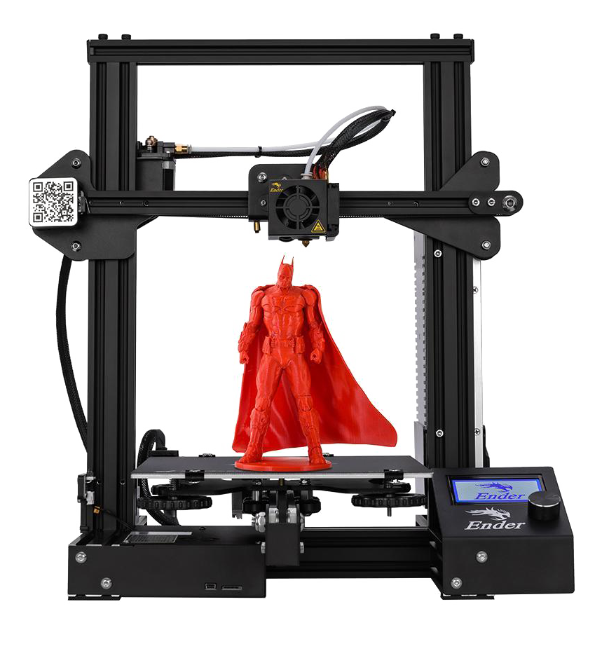
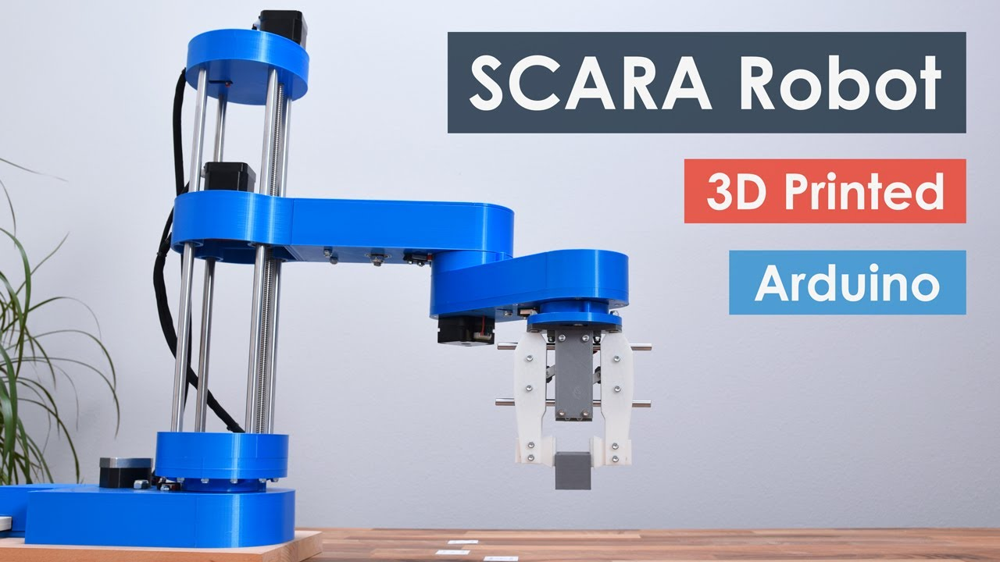
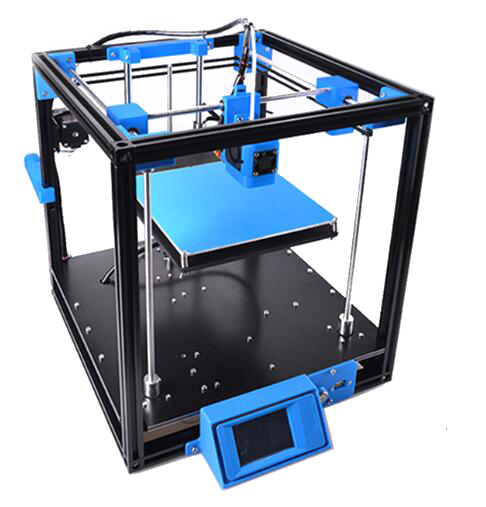
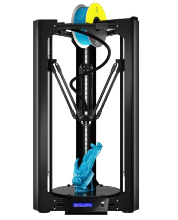
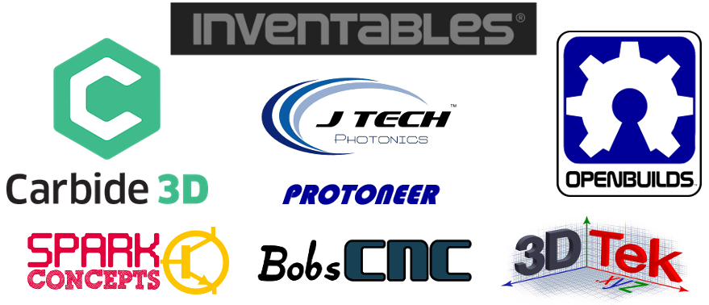
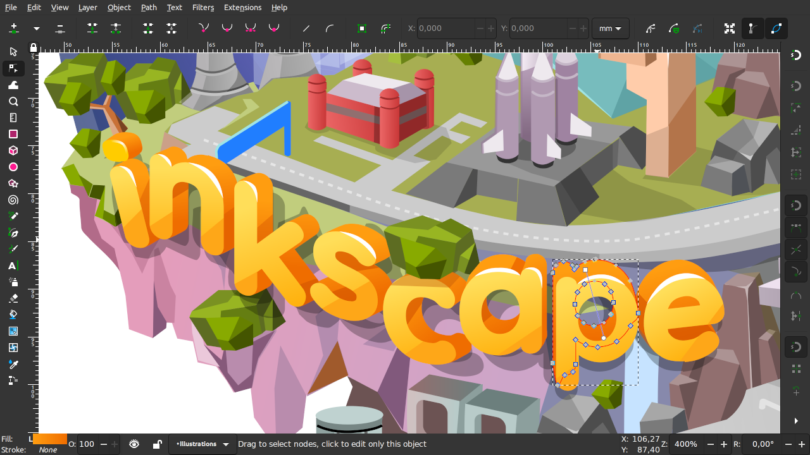

# 第一章——什么是CNC

雕刻机其实也是一种数控技术，所谓数控就是`CNC(computer numerical control)`，主要是用于自动化、机械化控制应用。CNC一般是高精度的代名词，可以做出非常多酷的机器，包括写字机，雕刻机，3D打印机，机械臂，铣床等等。这些机器的背后都是精确的数字化控制。

CNC机器主要由三个部分组成，包括`硬件(hardware)`，`固件(firmware)`和`软件(software)`。

硬件就是机器本体，固件是连接硬件和软件的桥梁，软件可以通过先固件发送指令，然后固件指导硬件运动。

下面我简单介绍一下这三个部分。

## 1. 硬件

CNC机器有很多种结构类型，我介绍几种常见的类型。

### 1.1 

大部分的CNC机器都是`XYZ型`的，也就是可以在X，Y及Z轴独立运动的机器，常见的3D打印机都是这种类型，同时我设计的雕刻机也是XY类型，这种机器控制起来比较方便。

### 1.2 SCARA robot

还有一种结构的CNC机器在制作机械臂方面应用比较广泛，一般称之为`SCARA robot`，这种结构的机器运动方式比较简单，搭建也很容易。

### 1.3 CoreXY类型

另外还有一种移动快速的`CoreXY类型`，这种类型的机器在运动的时候X轴和Y轴会相互牵连运动，从一点到另一点的也运动更加快速。这种结构在DIY CNC机器中使用比较多，商业化的很少。

### 1.4 Delta Robot

最后还有一种运动更加高效的CNC机器，叫做`Delta Robot`，这种结构的机器在3D打印机和工厂的流水线上都有使用，主要优点就是效率高，结构简单。

## 2. 固件

固件在CNC机器当中也可以称之为系统，比如日本的`FANUC系统`，德国的`西门子系统`，但是这些都属于商业工业用途的系统，DIY爱好者还是倾向于一些开源的固件。

其中比较流行的两个固件是[Grbl固件](https://github.com/grbl/grbl.git)和[Marlin固件](https://github.com/MarlinFirmware/Marlin.git)，这两个固件都相当地有名，有些3D打印机就是使用的Marlin固件，激光雕刻机使用GRBL固件比较多。大家可以前往GitHub详细了解这两个开源项目。

下面我介绍以下GRBL这个开源项目。

### 2.1 GRBL

GRBL这个项目最初是由`Sungeon (Sonny) Jeon`编写的，并且原项目是专门为Arduino的AVR芯片设计的，因此几乎每一个学习Arduino的人最终都会了解到这个项目。目前这个项目已经更新到1.1版本。

GRBL目前有以下几个官方合作的项目：

因为GRBL固件的流行，后来在GRBL的基础上逐渐衍生出其他功能更强大的开源项目，知名的项目有以下三个：

- [GRBL_ESP32](https://github.com/bdring/Grbl_Esp32.git)
- [grbl32](https://github.com/pvico/grbl32.git)
- [grblHALL](https://github.com/terjeio/grblHAL.git)

其中GRBL_ESP32主要是为ESP32设计的GRB了固件，支持脱机运行，WIFI连接，蓝牙连接等强大的功能。grbl32是为国内设计的廉价的STM32“蓝板”设计的，grblHALL同样是为了STM32芯片设计的CNC固件，支持的板子大部分的STM32开发板，功能也更加大，可以媲美大部分商业固件。有兴趣的可以前往这些项目的主页看一下。

不论是什么固件，它们都支持一种广泛用于CNC机器的编程语言，叫做`G-code`，也叫G代码。下面我简单介绍一下G代码。

### 2.2 G-code

之所以称之为G-code，是因为这种代码主要都是以G开头。大部分情况下我们不需要自己去写G代码，G代码一般都是软件直接生成的，你可以根据自己的需求对其中部分代码做改动，但前提是要懂得G代码的基本语法。

其实将G代码称之为G命令更妥当，下面是几个常用的命令：

| G命令  |       解释       |
| :----: | :--------------: |
|   G0   |   快速线性运动   |
|   G1   | 指定速度线性运动 |
|  G20   |    英寸为单位    |
|  G21   |    毫米为单位    |
|   G0   |   快速线性运动   |
|   M3   |  钻头顺时针运动  |
|   M4   |  钻头逆时针运动  |
|   M5   |     停止钻头     |
| M8，M9 |    冷却液控制    |

一般在雕刻机当中，M3，M4是用来控制激光头的功率的，在DIY的机器当中，你可以用M8，M9来控制风扇。

有关G代码的更多详细内容可参考[维基百科](https://en.wikipedia.org/wiki/G-code)。

解决了G代码的问题，我们一般还要解决GRBL的参数配置问题，这也是非常重要的一个环节。

### 2.3 GRBL的参数配置

GRBL目前一共有34个配置参数，打击不理解的话可以直接参考每个命令的建议值。GRBL的所有参数列表如下：

|命令|解释|
|:--|:--|
|$0=10|(steppulse, usec) STEP信号的高电平时间，建议`10us`。|
|$1=25|(step idle delay, msec) 步进电机除能延迟时间。当电机完成一个动作并停止时，经过此时间后，电机驱动模块的ENABLE引脚会拉高，除能电机锁定来节能。把该值设为最大值255来禁用电机延迟除能功能。|
|$2=0|(stepport invert mask:00000000) 步进脉冲信号反相掩码。默认情况下，步进信号从正常低电平开始，并在发生步进脉冲事件时变为高电平。反转后，步进脉冲的行为会从正常高电平切换为脉冲期间的低电平，然后再回到高电平。|
|$3=0|(dirport invert mask:00000110) 步进电机方向信号反相掩码。此设置反转每个轴的方向信号。默认情况下，Grbl假定当方向引脚信号为低电平时，轴沿正方向移动；当方向引脚信号为高时，轴沿负方向移动。|
|$4=0|(stepenable invert, bool) 步进电机使能信号反相设置。默认情况下，步进使能引脚为高电平是禁用电机驱动，而低电平是使能电机驱动。如果需要相反的操作，只需输入$4=1即可反转步进使能引脚的电平。|
|$5=0|(limit pins invert, bool) 限位IO口信号反相设置。 默认情况下，限位引脚通过Arduino的`内部上拉电阻`保持在高电平状态。当限位引脚为低电平时，Grbl将其解释为触发。对于相反的行为，只需输入$5=1即可反转触发电平。|
|$6=0|(probe pin invert, bool) 探针IO口信号反相设置。 默认情况下，探针由Arduino的内部上拉电阻保持在常高状态。当探针引脚为低电平时，Grbl将其解释为触发。对于相反的行为，只需键入$6=1即可反转探针。|
|$10=3|(status report mask:00000011) 状态报告掩码。当发送“?”给GRBL时，它会返回当前的实时数据。该数据包括当前运行状态，实时位置，实时进给速度，引脚状态，当前倍率值，缓冲区状态和当前正在执行的g代码行号（如果通过编译时选项启用）。本设置用于指定位置类型是显示机器位置（MPos:）还是工作位置（WPos:），但不能同时显示两者。在某些情况下，当通过串行终端直接与Grbl进行交互时，启用工作位置很有用，但是默认情况下应使用机器位置报告。还是可以启用查看Grbl的计划器和串行RX缓冲区的使用数据。这会显示各个缓冲区中可用的块或字节数。通常用于帮助确定在测试流接口时Grbl的性能。默认情况下应禁用此功能。|
|$11=0.020|(junction deviation, mm) 节点偏差。加速度管理器使用结点偏差来确定它可以在G代码程序路径的线段结点处移动的速度。例如，如果G代码路径急转10度，并且机器以全速移动，则此设置有助于确定机器需要减速多少才能安全通过弯道而不会丢失步数。|
|$12=0.002|(arc tolerance, mm) 圆弧公差。Grbl通过将G2 / G3圆，弧和螺旋细分为细小的细线来渲染G2 / G3的圆，弧和螺旋，以使弧跟踪精度永远不会低于此值。您可能永远不需要调整此设置，因为0.002mm它远低于大多数CNC机床的精度。但是，如果您发现自己的圆太粗或弧形追踪的速度很慢，请调整此设置。较低的值可提供较高的精度，但可能会因过多的细线使Grbl过载而导致性能问题。或者，较高的值会导致较低的精度，但由于Grbl需要处理的线数较少，因此可以提高圆弧性能。|
|$13=0|(report inches, bool) 位置坐标的单位设置。默认情况下，它设置为以mm为单位报告，但是通过发送$13=1命令，将此布尔标志发送为true，这些报告功能现在将以英寸为单位报告。$13=0重新设置为毫米。|
|$20=0|(soft limits, bool) 软限位开关。软限制是一项安全功能，可帮助您防止机器行驶太远且超出行驶限制，撞毁或破坏昂贵的物品。它通过了解每个轴的最大行程限制以及Grbl在机器坐标中的位置来工作。每当有新的G代码运动发送到Grbl时，它都会检查您是否意外地超出了机器空间。如果这样做，Grbl会在任何位置发出即时进给保持，关闭主轴和冷却液，然后设置系统警报以指示问题所在。机器位置将在之后保留，因为它不是由于硬限制而立即被迫停止。|
|$21=0|(hard limits, bool) 硬限位开关。硬限制的工作原理与软限制基本相同，但改用物理开关。基本上，您在每个轴的行进结束时或在任何您觉得如果程序移到不应移动的地方可能会遇到麻烦的地方，连接一些开关（机械的，磁性的或光学的）。开关触发后，它将立即停止所有运动，关闭冷却液和主轴（如果已连接），并进入警报模式，这将迫使您检查机器并重置所有内容。|
|$22=0|(homing cycle, bool) 归零使能位。 GRBL将控制3个轴移动以碰到限位开关，以此位置来作为零点。（归零时的移动方向，由后面的参数设置）|
|$23=1|(homing dir invert mask:00000001) 归位方向反相掩码。默认情况下，Grbl假设您的归位限位开关在正方向上，归位过程中会首先将z轴向正向移动，然后将xy轴正向移动，然后再通过在开关周围缓慢地来回移动来精确定位机器零点。|
|$24=400.000|(homing feed, mm/min) 归位进给速率，毫米每分钟。(homing feed, mm/min) 归位进给速率，毫米每分钟。|
|$25=3000.000|(homing seek, mm/min) 归位快速速率。归零时首先以较高的速率搜索限位开关，找到限位开关后，再以较低的进给速率移动到机床零位的精确位置。归位快速速率是最开始快的那个速度。|
|$26=250|(homing debounce, msec) 归零时限位开关消抖时间。每当开关触发时，开关上会出现一些电气/机械噪声。要解决此问题，您需要使用某种硬件来对信号进行反跳信号调节或通过软件延迟很短的时间使信号弹起。|
|$27=2.000|(homing pull-off, mm) 归零后移出限位开关距离。为了更好地利用硬限位功能，归零完成后，GRBL会把电机移出限位开关。它有助于防止在归零后意外触发硬限制。要确保该值足够大以清除限位开关。否则，Grbl将因未能清除错误而引发警报错误。|
|$30=100|(Max spindle speed, RPM) 钻头最大旋转速度。这个参数在雕刻机模式下就是激光的最大功率。|
|$31=0|(Min spindle speed, RPM) 钻头最小速度。这个参数在雕刻机模式下是激光的最小功率。|
|$32=1|(Laser mode enable, bool) 激光模式，布尔。该参数用于是否启用激光模式，如果启用，GRBL会优化机器的运动，使其更加符合激光的特性。|
|$100=80|(x, step/mm) x轴移动1毫米需要多少个脉冲。以我们常用的42步进电机为例，42步进电机是旋转一周200步，如果我们使用了A4988步进电机，三个跳帽都使用就是16步细分，那么旋转一圈就是200\*16=3200个脉冲。如果我们使用的是GT2同步轮，齿间距是2mm，一共有20齿，那么点击旋转一圈就是20*2=40mm，即移动一毫米需要3200/40=80个脉冲。|
|$101=80|(y, step/mm) y轴移动1毫米需要多少个脉冲。|
|$102=80|(z, step/mm) z轴移动1毫米需要多少个脉冲.|
|$110=3000.000|(x max rate, mm/min) x轴最大速率 毫米/分钟。确定这些值的最简单方法是通过逐渐增加最大速率设置并移动它来一次测试每个轴。|
|$111=3000.000|(y max rate, mm/min) y轴最大速率 毫米/分钟。|
|$112=3000.000|(z max rate, mm/min) z轴最大速率 毫米/分钟.|
|$120=1000.000|(x accel, mm/sec2) x轴加速度 毫米/(s2)。确定此设置的值的最简单方法是用缓慢增加的值分别测试每个轴。|
|$121=1000.000| (y accel, mm/sec2) y轴加速度 毫米/(s2)。|
|$122=1000.000|(z accel, mm/sec2) z轴加速度 毫米/(s2)。|
|$130=300.000|(x max travel, mm) x轴最大行程。这将以毫米为单位设置每个轴从一端到另一端的最大行程。仅当启用了软限制（和原点复归）时，此功能才有用，因为Grbl的软限制功能仅使用此功能来检查是否已通过运动命令超出了机器限制。|
|$131=300.000| (y max travel, mm) y轴最大行程。|
|$132=300.000|(z max travel, mm) z轴最大行程。|

更多有关GRBL参数配置的内容可参考这位Youtuber有关[GRBL Shield](https://www.youtube.com/watch?v=5KAFm3XMNlQ&list=PLJJWXVM5tQNqSfzYOUUsjYgfPH_-OvGpu)的内容，我认为他讲的很好很详细，值得大家学习。

## 3. 软件

使用雕刻机肯定就需要一个趁手的软件，好的软件可以大大提高效率。

目前为止，我所知道的、比较好用的开源软件是[LaserGrbl](https://lasergrbl.com/)，作者花了很多的心思和精力在这个软件上，虽然这个软件不是最好的，但是作为一个开源软件已经非常优秀了，使用起来效果也很好，大家可以支持一下。

这个软件虽然没有强大编辑能力，但是它支持.svg格式的图片，所以我们只需要把我们需要雕刻的图片或者文字借助.svg进行编辑，然后导入到LaserGrbl中就可以了。

[Inksacpe](https://inkscape.org/)就是一个比较好用、功能强大开源的软件。

