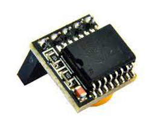
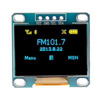

# 第一章——I2C的通信原理

## 1. I2C的Clock

前面讲到，I2C是同步通信，我们还记得UART是异步通信。这是因为，在UART中，数据的发送方只负责发送数据，接收方根据波特率进行接收数据。而I2C通过Clock同步双方的通讯过程，只要SCL出现了上升沿，那么从机就会接收数据，这样可以有效避免双方时间不同步的问题。

I2C有四种速率模式，也就是SCL的脉冲频率：

- **标准模式**：小于100KHz
- **快速模式**：小于400KHz
- **高速模式**：小于3.4MHz
- **超快速模式**：小于5MHz

我们可以拿I2C的快速模式400KHz和UART的115200，也就是115.2KHz相比，可见I2C的通信速度明显高于UART。但是I2C的速度远远低于SPI的速度，这个到我们介绍SPI再做介绍。值得注意的是，一般的设备都是**支持标准模式和快速模式**的，支持高速模式和超快速模式的设备比较少，也不建议I2C的通讯速度高于400KHz。

## 2. I2C的通讯过程

I2C有严格的时序要求，当SCL处于低电平期间，SDA可以改变其状态，而当SCL处于高电平期间，SDA的电平必须稳定，因为这时候接收方会读取当前的数据位。

标准的I2C通信由**START+ADDR+R/W+ACK(+DATA+ACK+DATA+ACK+...)+STOP**组成。

下面是标准的I2C通讯时序图：


下面我们对这几个部分做一一介绍。

### 2.1 START

I2C的开始信号是指SCL保持高电平的时候，SDA由高电平变为低电平。

### 2.2 STOP

I2C的结束信号正好和开始信号相反，在SDA低电平的时候，SCL由低电平变为高电平。

### 2.3 ADDR

I2C的地址位一般都是7位模式，也有10位模式，但是常用的还是7位模式。也就是说I2C可以由128个地址可以使用，但是**0-7是保留地址**，因此有**8-127**这120个地址可以使用。日常项目中几乎不会用这么多，所以完全不必担心地址不够用的情况。

### 2.4 R/W

一般情况下，继地址位之后就是读/写位，这一位决定了主机是需要向从机写数据还是读数据，0是写数据，1表示读数据。

### 2.5 ACK

无论是主机还是从机，在接收完数据后都需要发送一个应答位，应答位可以告诉对方是否接收到数据。

### 2.6 DATA

在发送完地址，收到从机的应答后，主机就可以接收或者发送数据了。每次只能发送一个8位的数据，和UART不同，数据由高位向低位进行发送。紧接着再发送一个ACK应答，然后可以再继续发送数据。

## 3. Arduino的Wire库

上面是I2C通讯的底层理论，但是通常情况下，任何一款单片机都是有封装好的硬件驱动的，Arduino的I2C驱动是Wire库，STM32是HAL_I2C，RP2040是i2c库。

下面我们对Arduino的Wire库中用的几个函数做简单介绍：

### 3.1 begin()

语法：

```cpp
Wire.begin();
Wire.begin(address);
```

用于初始化Arduino的I2C，如果你想让Arduino作为主机，参数为空，如果想让Arduino作为某个从机，则可以填入地址，一般情况下都是主机，可以为空。

### 3.2 beginTransmission()

语法：

```cpp
Wire.beginTransmission(address);
```

向从机发出开始信号，参数位从机地址。Arduino为了方便初学者使用，增加了`requestFrom()`函数，方便向从机读数据，虽然这样就完全掩盖了I2C的通讯原理，不过没办法，只能这么使用了。

### 3.3 write()

语法：

```cpp
Wire.write(value);
Wire.write(string);
Wire.write(data, length);
```

向从机发送数据，可以是一个字节的数据，也可以是一个字符串，或者是一个数组。

### 3.4 requestFrom()

语法：

```cpp
Wire.requestFrom(address, quantity);
Wire.requestFrom(address, quantity, stop);
```

向从机发送读数据的请求，读取的数据会存储在缓冲中，可以通过`read()`函数读取。参数address是从机地址，quantity是请求的字节数，可选参数stop是一个布尔值，0表示结束通信后会发送一个重新开始的信号，1表示结束通信后，发送结束通信的信号。

### 3.5 read()

语法：

```cpp
Wire.read();
```

从从机读取一个字节的数据。

### 3.6 endTransmission()

语法：

```cpp
Wire.endTransmission();
Wire.endTransmission(stop);
```

向从机发送一个结束通信的信号。在`Wire.endTransmission()`中，你还可以填入一个布尔值，如果是0，Arduino会发送一个重新开始的信号，然后你可以再次极性通讯；如果1，Arduino会发送停止信号，结束通信。

可以发现，在Wire库中没有提到ACK，这是因为Wire库自动为我们验证和发送了ACK。同时，由于使用了`requestFrom()`函数，导致I2C的通讯原理也被封装了，后面的例子中我将尽力解释清楚其中的原理。

下面是一个Arduino官网提供的I2C读取数据的例子：

```cpp
#include <Wire.h>

void setup() {
    Wire.begin();        // join i2c bus (address optional for master)
    Serial.begin(9600);  // start serial for output
}

void loop() {
    Wire.requestFrom(2, 6);  // request 6 bytes from slave device #2

    while (Wire.available())  // slave may send less than requested
    {
        char c = Wire.read();  // receive a byte as character
        Serial.print(c);       // print the character
    }

    delay(500);
}
```

## 4. 适用的设备

常见的使用I2C的设备有以下几个：

|                            DS3231                            |                            MPU6050                            |                            OLED                            |
| :----------------------------------------------------------: | :-----------------------------------------------------------: | :--------------------------------------------------------: |
|  |  |  |

我们会在下面的章节详细学习DS3231 RTC模块的使用。