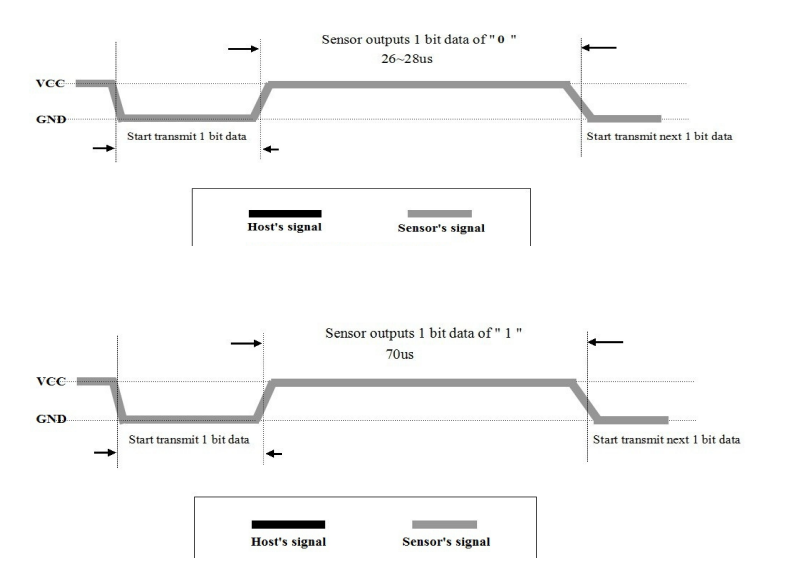
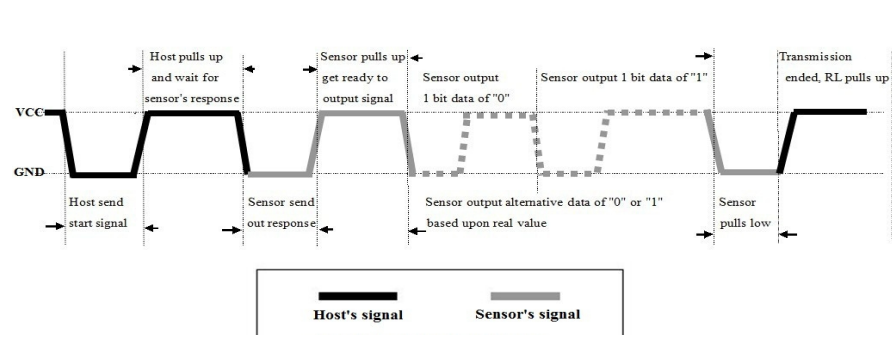

# 第二章——DHT11数据手册速览

## 1. DHT11的基本参数

|   参数   |   参数值    |
| :------: | :---------: |
| 供电电压 |  3.3V-5.5V  |
| 通信方式 |   单总线    |
| 湿度范围 | 20-90%±5%RH |
| 温度范围 |  0-50±2°C   |

## 2. DHT11引脚接线图
DHT11有四个引脚，其中一号引脚是电源接口（3.3-5.5V）；二号引脚是数据输入输出接口，数据手册中建议加一个上拉电阻；三号引脚悬空不接，四号引脚接地。

## 3. DHT11通信中的‘0’和‘1’
根据数据手册中的图，我们可以总结出DHT11是这样发送‘0’和‘1’的

**50us低电平 + 26-28us的高电平 = ‘0’**

**50us的低电平 + 70us的高电平 = ‘1’**

## 4. DHT11返回的数据格式
DHT11应答的数据有5个字节，其中包括2字节的湿度，2字节的温度，1字节的校验和；其中湿度和温度的第一个字节是整数位，第二个字节是小数位，高位在前，**校验和=湿度+温度**

虽然数据手册上表示湿度和温度的小数位都是0，但是我在实际操作过程中发现只有湿度的小数位是0，儿温度的小数位不会总是0。因为我轻信了数据手册，导致我在验证校验和的时候通过**湿度整数位+温度整数位!=校验和**而头疼了好久。所以说权威也有错误的时候。

## 5. DHT11和MCU的通讯过程
第一步，正常情况下信号线都是被拉高的，当MCU发送1-10ms的低电平后在拉高至少20-40us，然后等待DHT11应答。

第二步，DHT11接收到信号后将先拉低信号线80us，在拉高80us表明DHT11准备好了，MCU可以开始准备接受数据了。

第三步，接着DHT11将按照前面所讲的发送40位数据，发送完之后就再次把信号线拉高，通信结束。

值得注意的是，数据手册上特备说明了DHT11采集更新数据需要2秒钟，因此我建议两次完整的通信之间**至少间隔3秒钟**。
