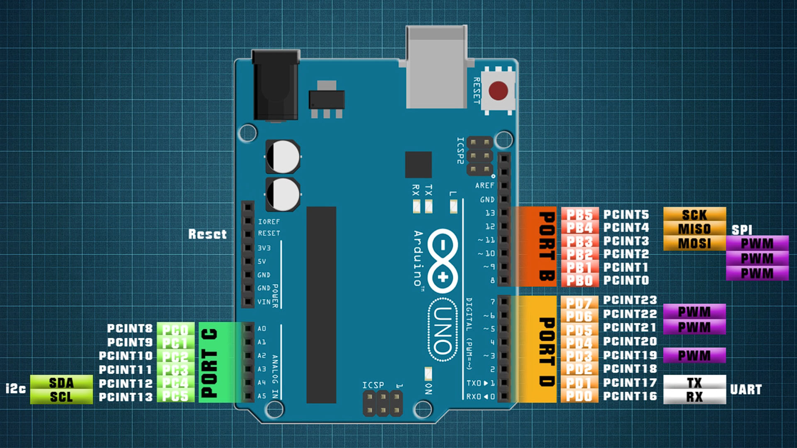
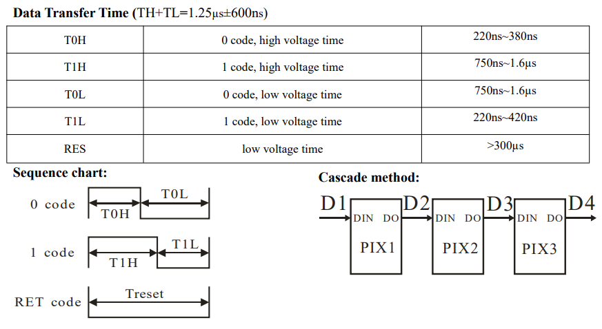

# 第五章——总结和拓展

## 1. 拓展一

通过实践可以发现，One—Wire非常重要的就是获取高低电平的时间，其实红外接收管的的信号也是由**开始信号+用户码+用户码(用户反码)+按键码+按键反码+结束信号**组成，通信过程几乎一致，感兴趣的同学可以自行查阅相关资料对红外信号进行解码。

下面是NEC协议的红外遥控的方波图：


## 2. 拓展二

由于通信对时序的要求很高，我们在代码中使用的是**digitalWrite()** 和 **pinMode()** 两个Arduino已经为我们封装好的函数，其实更好的方法是通过调用寄存器操作，但这样同时也会增加编程的难度。

感兴趣的同学可以参考下面的文章进行学习 [AVR I/O Register Configuration](https://exploreembedded.com/wiki/AVR_I/O_Register_Configuration)。



## 3. 拓展三

前面我们学习的是接收One-Wire发送的数据包，而One-Wire对数据发送对时序的要求更高，我们一般不直接通过软件实现对数据的发送，而是结合相应的硬件发送数据，如PWM，Timer，DMA，PIO等等。

下面以WS2812和DHT11的时序作对比：

|  bit  |       WS2812        |      DHT11      |
| :---: | :-----------------: | :-------------: |
|  ‘0’  | 0.40us H + 0.85us L | 50us L + 27us H |
|  ‘1’  | 0.80us H + 0.45us L | 50us L + 70us H |

下面是WS2812的时序表，想挑战一下的可以尝试如何自己驱动点亮WS2812：



## 4. 拓展四

C++一大特点就是面向对象，使用class对代码进行封装可以大大简化代码，每次使用直接**声明对象，调用函数**就可以了。

大家可以自行了解学习有关C++的class内容，下面我不作特别说明地将原来的代码改成C++的class：

```cpp
#define TIMEOUT 1e5
#define DHT11_OKAY 0x00
#define DHT11_ERROR 0x01

class DHT11 {
  private:
    uint8_t sensorPin;

    uint32_t getLowTime() {
      uint32_t lastTime = micros();
      while (!digitalRead(sensorPin)) {
        if (micros() - lastTime > TIMEOUT) {
          break;
        }
      }
      return (micros() - lastTime);
    }

    uint32_t getHighTime() {
      uint32_t lastTime = micros();
      while (digitalRead(sensorPin)) {
        if (micros() - lastTime > TIMEOUT) {
          break;
        }
      }
      return (micros() - lastTime);
    }

  public:
    uint8_t humidity;
    float temperature;

    DHT11(uint8_t pin) {
      sensorPin = pin;
      humidity = temperature = 0;
    }

    bool updataData() {
      /*MCU发送开始信号, 并等待应答*/
      pinMode(sensorPin, OUTPUT);
      //拉低18ms
      digitalWrite(sensorPin, LOW);
      delay(18);
      //拉高40us
      digitalWrite(sensorPin, HIGH);
      delayMicroseconds(40);

      /*接受DHT11做出的应答*/
      pinMode(sensorPin, INPUT_PULLUP);
      getLowTime();
      getHighTime();

      /*开始接受40bit数据*/
      uint8_t buffer[5] = {0};
      for (uint8_t i = 0; i < 5; i++) {
        for (uint8_t j = 0; j < 8; j++) {
          getLowTime();
          if (getHighTime() > 50)
            buffer[i] |= (0x80 >> j);
        }
      }

      /*结束通信*/
      getLowTime();

      /*检查校验和*/
      if (buffer[0] + buffer[1] + buffer[2] + buffer[3] != buffer[4])
        return DHT11_ERROR;

      /*更新数据*/
      humidity = buffer[0];
      temperature = buffer[2] + buffer[3] * 0.1;
      return DHT11_OKAY;
    }
};

DHT11 myDHT11(2);

void setup() {
  Serial.begin(115200);
}

void loop() {
  switch (myDHT11.updataData()) {
    case DHT11_ERROR:
      Serial.println("DHT11 ERROR!");
      break;
    case DHT11_OKAY:
      Serial.print("DHT11 Okay,humidity is ");
      Serial.print(myDHT11.humidity);
      Serial.print(", temperature is ");
      Serial.println(myDHT11.temperature);
      break;
  }
  delay(3000);
}
```